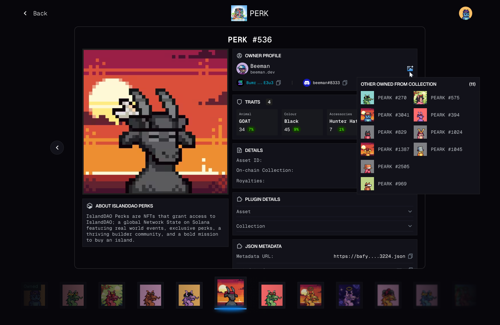

# NFT Edge tab

> A third top-level tab — iOS-style horizontal NFT rail with a large detail pane, inspired by Pubkey's collection viewer.

## What it is

A NFT browsing surface that **stays in motion** — large hero artwork in the centre, a horizontal scroller of thumbnails along the bottom, click a thumbnail and the whole detail pane swaps with a smooth crossfade. Feels more like flipping through a deck than navigating a grid.

The right rail shows owner profile, traits, asset/collection metadata, and a hover-revealed "Other Owned from Collection" panel.



## Where it lives in the app

```
┌─ Y-Vault ──────────────────────────────────────────────┐
│  [Token Edge] [Trade Edge] [NFT Edge*]                 │
├────────────────────────────────────────────────────────┤
│             ┌──────────────────────┐  Owner Profile    │
│             │                      │   beeman.dev      │
│             │   NFT artwork        │   Bumr...E3u3 ⧉   │
│             │   (large hero)       │                   │
│             │                      │  Traits   ⓘ      │
│             │   PERK #536          │  ┌─────────────┐  │
│             └──────────────────────┘  │ Animal: GOAT │ │
│                                       │ Colour: Black│ │
│  About IslandDAO PERKS                │ Hat: Hunter  │ │
│  IslandDAO Perks are NFTs that grant  └─────────────┘  │
│  access to IslandDAO; a global         Details         │
│  Network State on Solana…              Asset ID: …    │
│                                                        │
│ ◀ [▣][▣][▣][▣][▣][▣*][▣][▣][▣][▣] ▶                    │
│    ↑                ↑                                  │
│    "Owned" badge   selected (glowing underline)        │
└────────────────────────────────────────────────────────┘

  Hover on traits ⓘ icon → tooltip panel
    "Other Owned from Collection (11)"
    [▣ PERK #270] [▣ PERK #575] …
```

## Sketch — horizontal rail mechanics

```
The rail is the load-bearing interaction.

  ◀  [a][b][c][d][e*][f][g][h][i]  ▶
        │  │  │  │  │  │  │  │  │
        └──┴──┴──┴──┴──┴──┴──┴──┘
              ↑
        scroll-snap aligned
        each thumb: 72×72, 8px gap
        selected: 1px glow border + soft underline
        owned (in user's wallet): top-left badge

  Keyboard: ← / → cycle, swap detail pane.
  Touch:    swipe horizontally, momentum-scroll.
  Mouse:    horizontal wheel, or click ◀ / ▶ at edges.

  Detail pane swap: 200ms crossfade,
                    artwork loads via low-res blurhash first,
                    pop in full-res when ready.
```

## Open questions

- **Scope = collection-wide or wallet-scoped?** The reference shows both modes (you can browse the whole collection AND see which ones you own). v1 = wallet-scoped (your NFTs)? Or collection-wide?
- **Data source:**
  - Helius DAS API — best Solana NFT API
  - Tensor / Magic Eden — collection-floor + listing data
  - SimpleHash — multi-chain if we ever extend
- **Owner profile resolution:** `.sol` name (SNS), Bonfida, civic, custom protocols?
- **Floor / last sale** shown on thumbnails or only in detail?
- **Animated NFTs:** mp4, glb (3D), HTML mints — defer to v1.5?
- **Rarity score** — compute ourselves (HowRare-style) or rely on collection metadata?
- **Stable URL per NFT** — `/nft/<collection>/<id>`? `/nft/<mint>`?
- **Empty state** — if the user has no NFTs in their wallet, what shows? Suggested collections? Recent mints?

## Out of scope (first pass)

- **Listing / buying / minting** from inside the app. NFT Edge is read-only.
- Cross-collection rarity comparison.
- Trait-attribute search ("show all PERKs with Hunter Hat").
- Bulk operations (multi-select to send/list).
- Activity feed (mint history, sale history per NFT).

## Prior art / reference

- [Pubkey collection viewer](https://pubkey.app/) — direct inspiration; iOS-style horizontal rail
- [Tensor trade UI](https://www.tensor.trade/) — Solana-native NFT marketplace
- iOS Photos app — the rail-and-hero pattern itself
